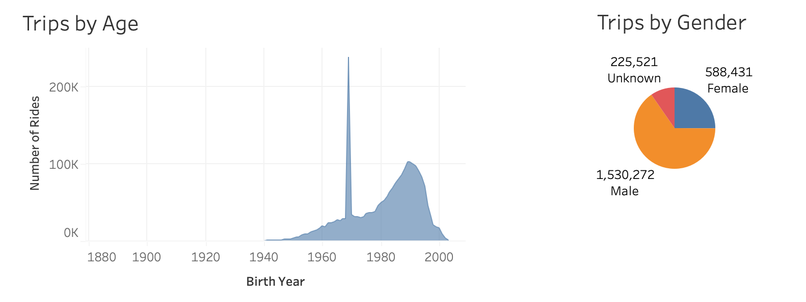
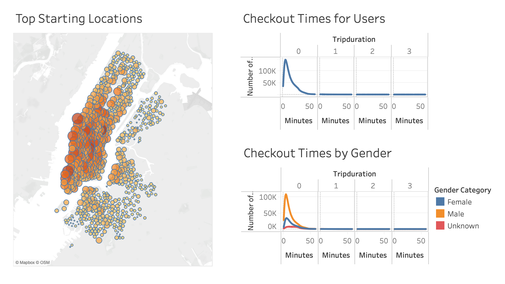
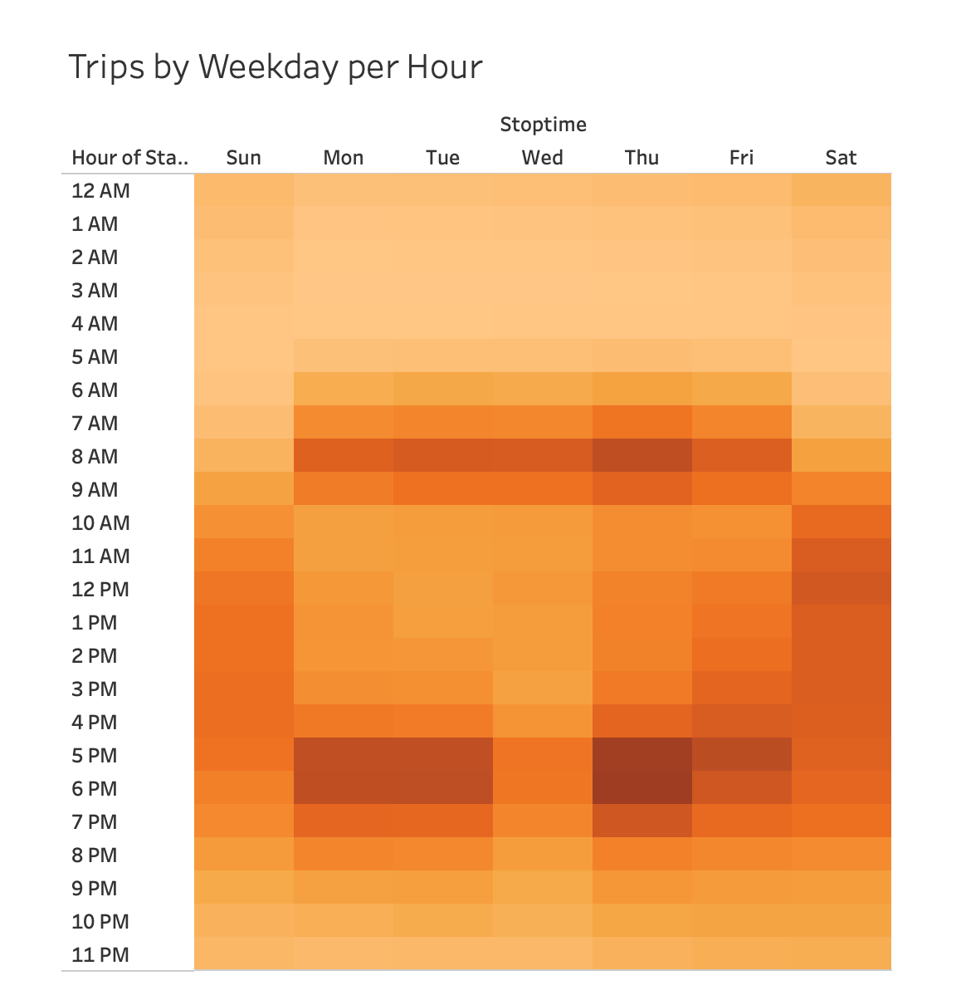
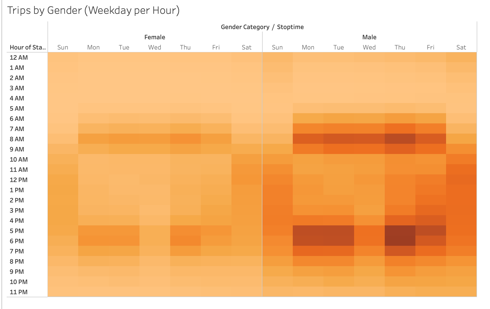
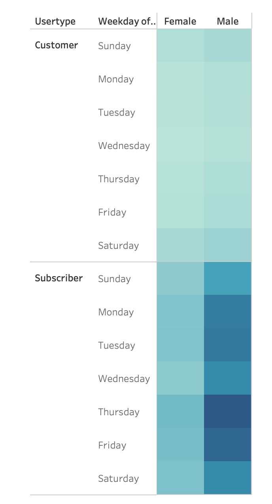

# NYC Bikesharing Analysis

## Overview of the analysis
The purpose of this project is to analyze NYC bikesharing data for August 2019 to identify the rental trends with the purpose of opening a bikesharing service in Des Moines. Below I present my  conclusions from the analysis. 

You can also view a Tableau dashboard [here](https://public.tableau.com/app/profile/togneva/viz/NYCBikesharingAnalysis_16468099353850/NYCBikesharingStory). 

## Results: 
As the US population becomes more health aware and envoronment concious, the biking trend is on the rise.

People of all ages are jumping on the trend with the most active users between 20-60 year old. 50-55 years-olds are by far the most active bike renters. Also, male riders significantly outnumber female riders.

Manhattan has the highest rate of bike rentals with most bikes rented for 30 minutes or less  and the average bike ride time of 6-7 minutes. While men account for more bike  rentals than women, the rental patterns between male and female users seem to be very similar.

While one might think that heavy Manhattan bike rental patterns are due to tourists, the busiest checkout times are during workweek rush hours of 8-9 AM and 5-7 PM. This might suggest that many students/employees are relying on bikes for commuting to and from school/work.

Saturdays and Sundays, though not as busy as peak hours, also have higher rental volumes.

As we have already seen previously, men rent bikes more often then women. However, rental patterns across the gender are roughly the same with rush hours being the busiest for both male and female customers, followed by the weekends.

Looking at the rental patterns across days of the week and comparing Customers to Subscribers, we confirm again that the busiest days are Monday, Tuesday, Thursday and Friday, with Subscribers checking out bikes more frequently than ordinary customers. 

Once again, these patterns are consistent across the gender with male and female renters exibiting the same behaviour.

## Summary: 
Overall, there is sufficient interest in bike sharing to consider opening such service. 

Key Findings:

1. Subscribers by far outweigh occasional renters. This suggests that bikesharing business does not rely on tourists and could be viable in non-tourist cities as well. 

2. No significant difference in rental patterns is identified between men and women though rental volume is significantly lower for women.

 Hypothetically, this could be due to safety concerns or potentially office attire not beig conducive to biking. I'd like to dig deeper and see if there is a difference in locations where men and women rent the bikes. 
  - Do women prefer to rent away from busy streets? 
  - What institutions are close by? Is there more activity closer to schools/work places with casual attire (coffee shops, stores, etc) vs. business offices? 
  
  Understanding the most popular locations by gender would help equip the shops with appropriate ratios of male/female versions of the bikes/helmets/gloves and provide additional merchandise/services geared towards males/females.

 Similar analysis could be conducted for customers based on their age. Preferences for styles vary greatly between generations and this could help stock the shop with the styles that would appeal to all users.

Another analysis I'd like to conduct is to look at which locations are most popular based on the day and time. Are locations close to downtown business offices busy on the weekends? If not, it may not be necessary to keep them open, or reduced hours might be recommended. Based on the location demand by day/time, we may also need to redirect some inventory between the locations.
